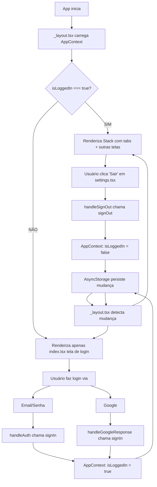

# Correções aplicadas ao fluxo de autenticação

## Problema identificado
A tela de login estava em `/app/index.tsx` mas havia redirecionamentos automáticos (`router.replace('/(tabs)')`) que impediam o fluxo correto quando o usuário fazia logout. Além disso, havia um `useEffect` que causava loops desnecessários.

## Mudanças aplicadas

### 1. **Removidas as chamadas `router.replace('/(tabs)')`**
   - **Local 1**: Linha ~97 - Removida de `handleAuth()` (login/signup por email)
   - **Local 2**: Linha ~131 - Removida de `handleGoogleResponse()` (Google Sign-In)
   
   **Motivo:** O roteamento agora é automático via `_layout.tsx` que observa mudanças em `isLoggedIn`.

### 2. **Removido o `useEffect` que fazia redirecionamento automático**
   ```typescript
   // ❌ REMOVIDO:
   useEffect(() => {
     if (isLoggedIn) {
       router.replace('/(tabs)');
     }
   }, [isLoggedIn, router]);
   ```
   
   **Motivo:** Causava loops de renderização; o `_layout.tsx` já gerencia os redirecionamentos corretamente.

### 3. **Removidas as imports desnecessárias**
   - `import { useRouter } from 'expo-router'` ❌
   - `const router = useRouter()` ❌
   
   **Motivo:** Como o componente não faz mais redirecionamentos manuais, não precisa dessas.

---

## Novo fluxo de autenticação 



---

## Como testar o fluxo completo

### Opção 1: Via Expo (Fresh Start)
```bash
# Limpar cache completo
cd front-end/kod-finance
npm start -- --clear

# Ou se usar yarn:
yarn start --clear
```

Então:
1. Escanear QR code com dispositivo teste
2. Verificar que **tela de login aparece**
3. Tentar login:
   - ✅ Email inválido: erro visível
   - ✅ Senha < 6 caracteres: erro visível
   - ✅ Email válido + senha válida: vai para dashboard
4. Em Settings → Sair:
   - Deve voltar à tela de login imediatamente
5. Fazer login novamente:
   - Deve funcionar normalmente (sem ser bloqueado)

### Opção 2: Teste manual de AsyncStorage
Se quiser testar sem app visual, rodar este código no Context:

```typescript
// Adicione esta função ao AppContext para DEBUG:
export async function debugClearAuth() {
  await AsyncStorage.removeItem('@kod_finance:loggedIn');
  await AsyncStorage.removeItem('@kod_finance:user');
}

// Chame em Settings antes de logout para simular fresh install
```

---

## Status atual

✅ **Componente `/app/index.tsx`**
- Sem redirecionamentos manuais
- Sem loops de useEffect
- Chamadas simples a `signIn()` quando login bem-sucedido

✅ **Roteamento `/app/_layout.tsx`**
- Condiciona toda renderização em `isLoggedIn`
- Renderiza apenas `index` se `false`
- Renderiza `(tabs)` + outras telas se `true`

✅ **AppContext**
- `signIn()` atualiza `isLoggedIn = true` + persiste
- `signOut()` atualiza `isLoggedIn = false` + persiste
- Mudanças automáticas no AsyncStorage

✅ **Settings `/app/(tabs)/settings.tsx`**
- Botão "Sair" chama `signOut()` corretamente
- Roteador detecta mudança de `isLoggedIn`

---

## Próximos passos (opcional)

**Melhorias futuras:**
1. Adicionar splash screen que mostra enquanto AppContext carrega do AsyncStorage
2. Implementar password recovery backend
3. Adicionar biometric auth (Face ID/Fingerprint)
4. Mostrar loading spinner global durante auth check inicial

